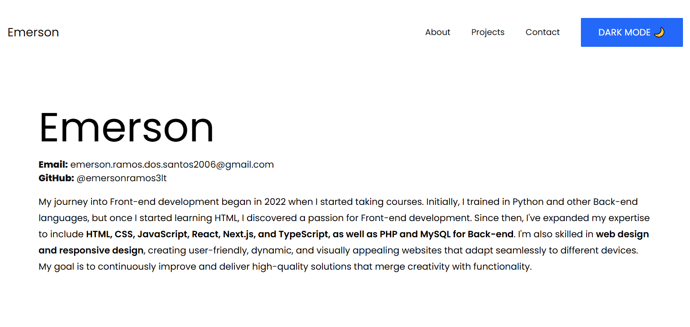
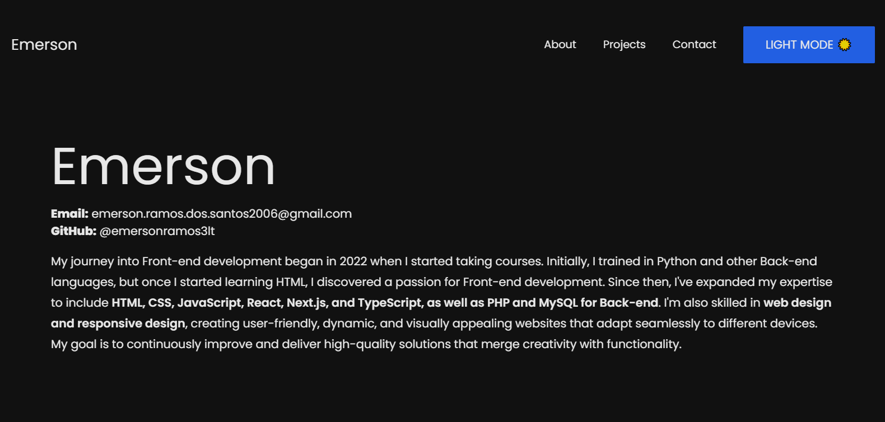

# Description

This portfolio showcases my skills and passion for Front-end development, featuring a responsive design that adapts seamlessly to any screen size. It includes smooth scroll 
functionality for a polished navigation experience when clicking on links. Additionally, the portfolio offers both light and dark modes, allowing users to switch themes according 
to their preference. This project highlights my attention to detail and focus on creating intuitive and visually appealing user interfaces.

# Main Features
- HTML CSS
- JavaScript
- ScrollReveal
- Dark/light mode
- Smooth scroll

# Screenshot

## Light mode

## Dark mode

