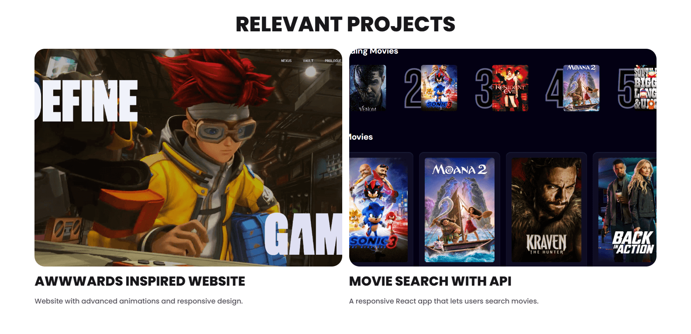

# **🖥️ Personal Portfolio**  

This is a single-page portfolio built with **React**, designed to showcase my work in a clean and minimalist way, focusing only on the essentials. The page features a **downloadable resume (PDF)**, a **project showcase**, and a **contact section** in the footer, where visitors can reach out or explore my social media links.  

For smooth and engaging interactions, I used **Framer Motion** to create a custom animated cursor, enhancing the browsing experience. Additionally, **AOS Library** was implemented for lightweight scroll animations, making the website more dynamic while maintaining optimal performance.  

# **🛠️ Main Features**  
- **React** for a fast and dynamic UI  
- **Framer Motion** for a custom animated cursor  
- **AOS Library** for smooth scroll animations  
- **Minimalist design** focused on essentials  
- **Downloadable resume (PDF)**  
- **Project showcase**  
- **Contact section** with social links  

# **📷 Screenshots**  

